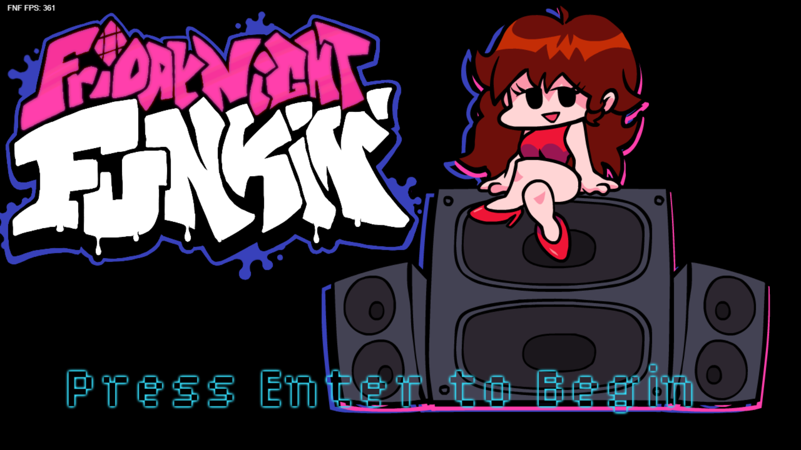
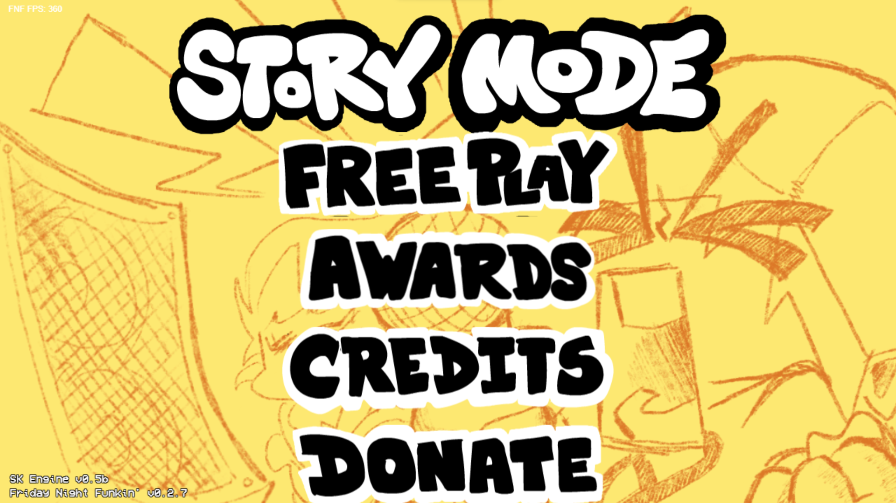
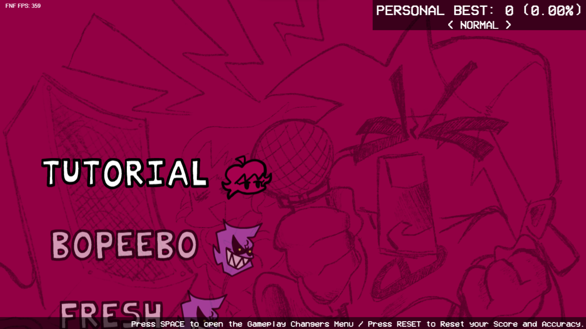
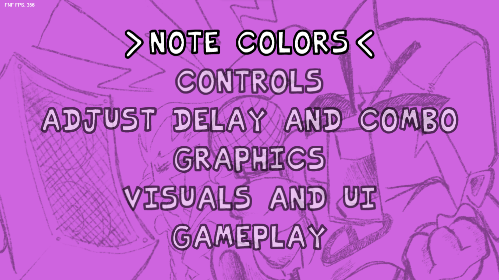
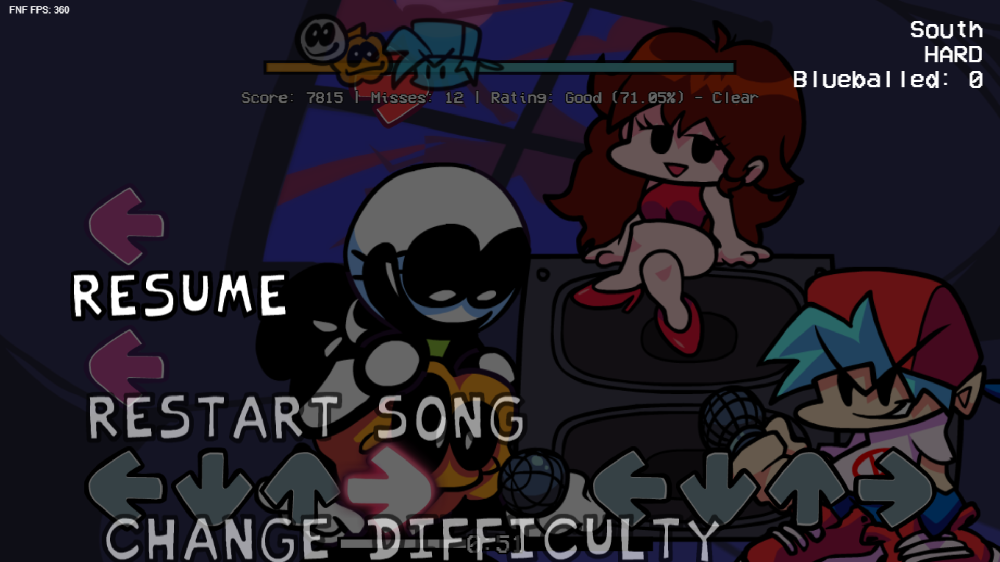

<!--update1-->
<!--woah-->

][    

       

## Friday Night Funkin'
**Friday Night Funkin'** is a rhythm game originally made for Ludum Dare 47 "Stuck In a Loop".

Links: **[itch.io page](https://ninja-muffin24.itch.io/funkin) ⋅ [Newgrounds](https://www.newgrounds.com/portal/view/770371) ⋅ [source code on GitHub](https://github.com/ninjamuffin99/Funkin)**

Links: **[GameBanana mod page](https://gamebanana.com/mods/491438) ⋅ [play in browser](https://kornineq.de/skengine) ⋅ [latest stable release](https://github.com/KornineQ/sk-engine/releases/latest)**

**REMEMBER**: This is a **mod**. This is not the vanilla game and should be treated as a **modification**. This is not and probably will never be official, so don't get confused.

## Website ([KornineQ.de](https://kornineq.de/)) (Here)
If you're looking for documentation, changelogs, or guides, you can find those on the Kade Engine website.

# Previews ([skip](#features))

# Features

 - **New Input System**
	 - An improved input system, similar to Quaver or Etterna, with less delays, less dropped inputs and other improvements.
 - **More information during gameplay**
	 - While you're playing, we show you information about how you're doing, such as your accuracy, combo break count, notes per second, and your grade/rating.
 - **Customizable keybinds**
	 - Instead of being forced to use WASD and the arrow keys, you can set any keybinds you want!

# Credits
### Friday Night Funkin'
 - [ninjamuffin99](https://twitter.com/ninja_muffin99) - Programming
 - [PhantomArcade3K](https://twitter.com/phantomarcade3k) and [Evilsk8r](https://twitter.com/evilsk8r) - Art
 - [Kawai Sprite](https://twitter.com/kawaisprite) - Music

This game was made with love to Newgrounds and its community. Extra love to Tom Fulp.
### SK Engine
- [KornineQ](https://twitter.com/KornineQ) - Maintainer and lead programmer
